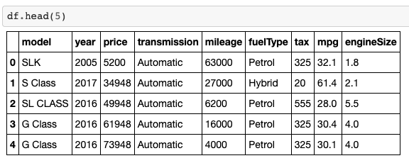
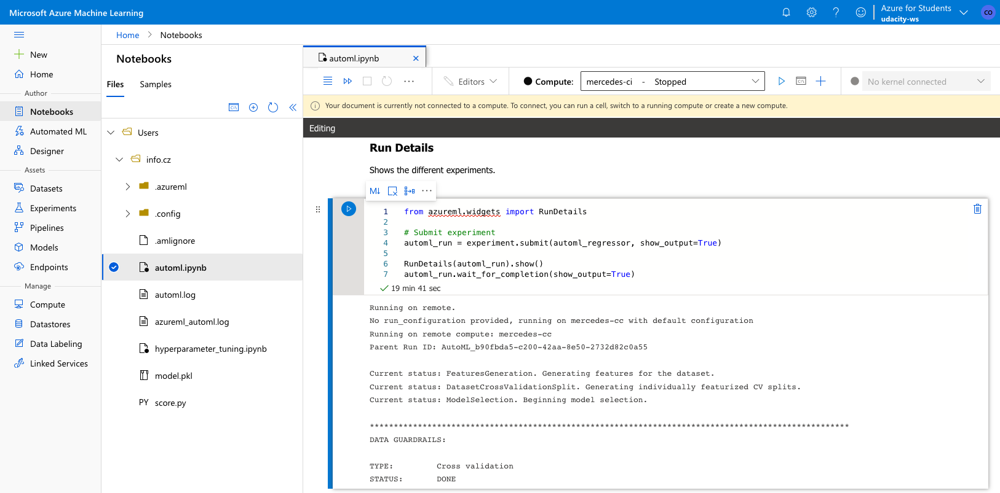
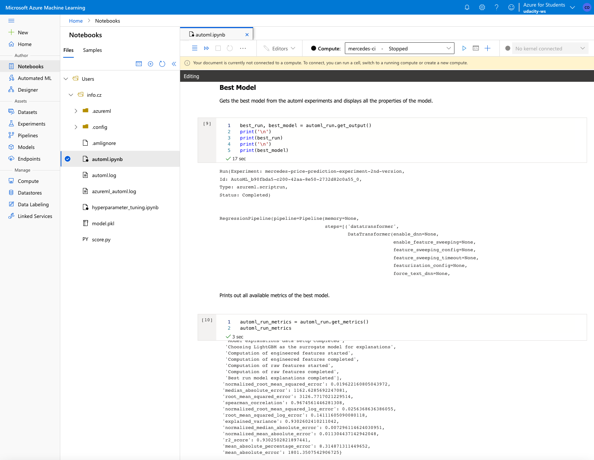
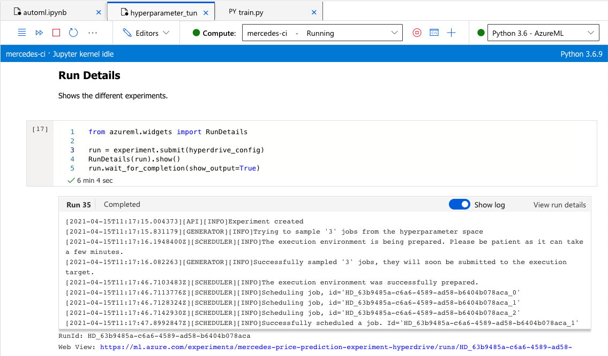
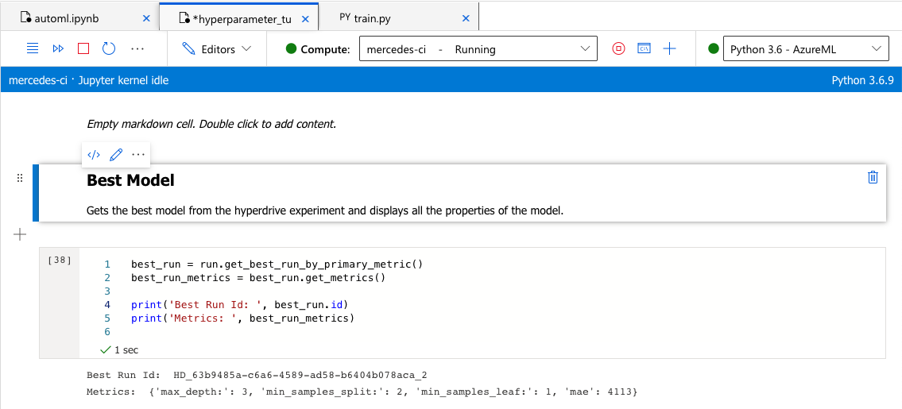
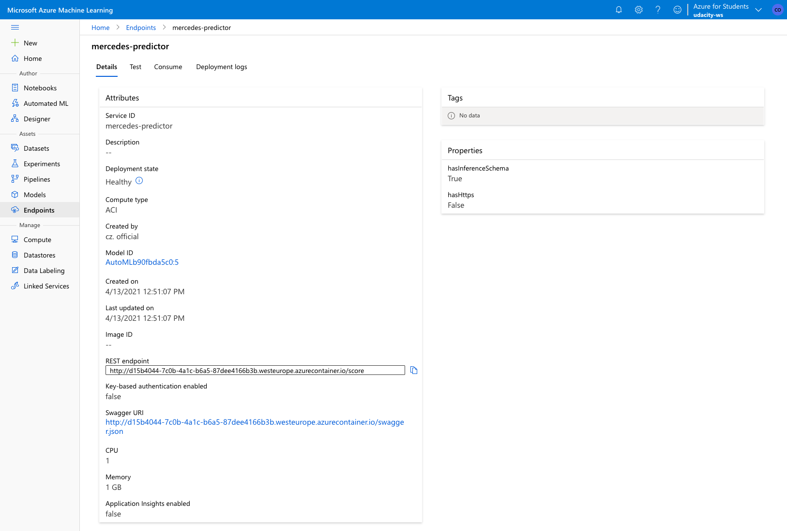

# Price Prediction of Mercedes-Benz Used Cars

* [Project Overview](#project-overview)
* [Dataset](#dataset)
* [Automated ML](#automated-ml)
* [Hyperparameter Tuning](#hyperparameter-tuning)
* [Model Deplyoment](#model-deployment)
* [Screen Recording](#screen-recording)
* [Future Improvements](#future-improvements)

## Project Overview
This project is part of the Udacity Azure ML Nanodegree.


## Dataset
### Overview
For this project, I used a kaggle dataset consisting of scraped data of used car listings from the UK. It originally consists of 100.000 used cars, but I only used around 13.000 Mercedes-Benz used cars for the project. The dataset contains information of price, transmission, mileage, fuel type, road tax, miles per gallon (mpg), and engine size.

[Here is the link to the kaggle dataset.](https://www.kaggle.com/adityadesai13/used-car-dataset-ford-and-mercedes)

### Task
In this project, I used Automated ML and in a second approach HyperDrive to create a regression model to predict Mercedes-Benz used car prices. For testing the endpoint later on, I will use the information there is on the G-Class (line 3) with a price tag of around 62.000 British Pounds. Let's see how the model will perform.



### Access
The dataset was uploaded and registered manually in the Azure ML workspace and can be used directly in the notebooks. For the train.py script, I used TabularDatasetFactory to download the dataset directly from my GitHUb repository.


## Automated ML
### Overview
This is an overview of the settings and configurations I used for this experiment:

````
# automl settings
automl_settings = {
    "experiment_timeout_minutes": 15,
    "max_concurrent_iterations": 5,
    "primary_metric": "normalized_mean_absolute_error",
    "featurization": 'auto',
    "enable_early_stopping": True,
}

# automl config
automl_regressor = AutoMLConfig(
    compute_target=cpu_cluster,
    task="regression",
    training_data=dataset,
    label_column_name="price",
    **automl_settings
    )
````

As this project does not focus on model performance, but rather on the end-2-end implementation of such a model, I chose to timeout the experiment after 15 minutes. As primary metric, I chose the (normalized) mean absolute error as it is the easiest one to understand for business stackeholders, especially when it comes to the deviation in British Pounds. In terms of the configuration, I chose regression as a task and obviously the y label as price.

### Results
The results were already decent with a mean absolute error (MAE) of around 1.800 British Pounds. R2 score was 93%. In this case, the best model was a LightGBM algorithm. To be more precise: actually a Voting Ensemble, consisting of just a LightGBM. LightGBM, short for Light Gradient Boosting Machine, is a gradient boosting framework for machine learning and based on decision tree algorithms.

Some parameters of the LightGBM (best model) were the followig:
````
('Max...
                                                               colsample_bytree=1.0,
                                                               importance_type='split',
                                                               learning_rate=0.1,
                                                               max_depth=-1,
                                                               min_child_samples=20,
                                                               min_child_weight=0.001,
                                                               min_split_gain=0.0,
                                                               n_estimators=100,
                                                               n_jobs=1,
                                                               num_leaves=31,
                                                               objective=None,
                                                               random_state=None,
                                                               reg_alpha=0.0,
                                                               reg_lambda=0.0,
                                                               silent=True,
                                                               subsample=1.0,
                                                               subsample_for_bin=200000,
                                                               subsample_freq=0,
                                                               verbose=-1)
````

This is a screenshot showing the run details:


This is a screenshot showing the best run:



## HyperDrive
### Overview
I chose a RandomForest the best model of AutoML (LightGBM) also favours a tree/forest approach. Random forests or random decision forests are an ensemble learning method for classification, regression and other tasks that operate by constructing a multitude of decision trees at training time and outputting the class that is the mode of the classes (classification) or mean/average prediction (regression) of the individual trees.\n

The interesting part here is probably the hyperparamter search:
````
param_sampling = RandomParameterSampling(
    {
        '--max_depth': choice(range(1, 5)),
        '--min_samples_split': choice(2, 5),
        '--min_samples_leaf': choice(range(1, 5))
    }
)
````
As I put no effort into the training of the RandomForest, I didn't leave the model much of a choice here: Max depth only 5, min split only 2 or 5 and min leaf only up to 5. One word to the RandomParameterSampling Class: It defines random sampling over a hyperparameter search space.

### Results
The results were somewhat as expected. At the end, the model only trained for about 5 minutes (compared to AutoML with around 15 minutes). Mean average error was 4.100 British Pounds. Not the worst, but also not the best compared to AutoML.\n

Here are the chosen parameters of the best model:
````
Metrics:  {'max_depth:': 3, 'min_samples_split:': 2, 'min_samples_leaf:': 1, 'mae': 4113}
````

This is a screenshot showing the run details:


This is a screenshot showing the best run:


*TODO*: What are the results you got with your model? What were the parameters of the model? How could you have improved it?

*TODO* Remeber to provide screenshots of the `RunDetails` widget as well as a screenshot of the best model trained with it's parameters.


## Model Deployment
I only deployed the AutoML model since it performed better. This was done in the AutoML notebook by creating an Azure Container Instance (ACI). Basically, one runs a Docker container in a managed, serverless Azure environment to quickly deploy the model.

This screenshots shows the AutoML model endpoint. It also shows the deployment state as healthy:


The interesting part here is though the query on the endpoint with my G-Class example described above:
````
data = [{
    "model": "G Class",
    "year": 2016,
    "transmission": "Automatic",
    "mileage": 16000,
    "fuelType": "Petrol",
    "tax": 325,
    "mpg": 30.4,
    "engineSize": 4.0, 
     }]
````

The output result of the endpoint was satisfactory as the deviation was only around 7.000 British Pounds:
````
{"result": [56265.4312647257]}
````


## Screen Recording
This screen recording shows the entire process of the application, including the following areas:
- A working model
- Demo of the deployed model
- Demo of a sample request sent to the endpoint and its response

[Here is the link to the screen recording (5 minutes).](https://www.dropbox.com/s/i6jcczzno9j6t6f/Udacity_ML-Engineer_with_MS-Azure_Project-03_Screen-Recording.mov?dl=0)

## Future Improvements
- AutomatedML
The model could've been improved with more time given for the actual training. Another way would've been bringing in additional data, at least for each class.

- HyperDrive
The model could've been improved with a larger parameter space / more possibilities for the parameters.

\n
However, as I said, model performance was not the focus on this project for me.